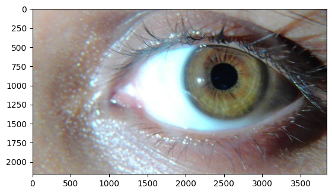
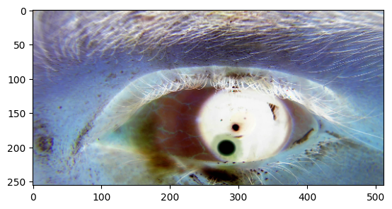
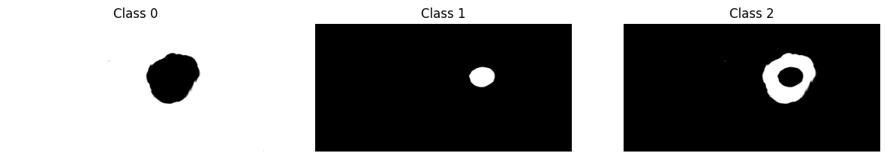

# Iris Segmenter — End-to-End Optic Disc Segmentation

> **Status:** Training and evaluation datasets are confidential and not included. The full pipeline code — preprocessing, model definition, training, and evaluation — is in the notebook.

A deep learning pipeline for **pixel-wise segmentation of the optic disc and pupil** from retinal video frames, producing 3-class segmentation masks for downstream glaucoma assessment. Built with a custom U-Net in TensorFlow/Keras, trained on Colab with Google Drive data storage.

---

## Table of Contents
- [Problem Statement](#problem-statement)
- [Pipeline Overview](#pipeline-overview)
- [Model Architecture](#model-architecture)
- [Custom Loss & Metrics](#custom-loss--metrics)
- [Results](#results)
- [How to Run](#how-to-run)
- [Requirements](#requirements)

---

## Problem Statement



Accurate optic disc and pupil segmentation from retinal imaging is the foundational step for:
- **Glaucoma detection** — cup-to-disc ratio measurement requires a precise disc boundary
- **Pupillometry** — pupil size tracking for neurological assessment
- **Surgical robotics** — real-time eye tracking for laser/robotic surgery guidance

Input: RGB eye video frames (400×200 px) extracted from a Cirrus ophthalmic imaging device at 1 fps.  
Output: Per-pixel 3-class segmentation mask.

---

## Pipeline Overview



```
Eye Video (.mp4)
      │
      ▼
Frame Extraction (OpenCV, every 1 frame)
1,200 training frames + 2,066 test frames
      │
      ▼
Preprocessing
  ├── Resize to 400×200 px
  ├── Normalise pixel intensities [0, 1]
  └── Paired image+mask augmentation
      │
      ▼
U-Net (TensorFlow/Keras)
  ├── Encoder (4 stages, 8→16→32→64 filters)
  ├── Skip connections
  └── Decoder (4 upsample stages)
      │
      ▼
3-Class Output Map
  ├── Class 0: Background
  ├── Class 1: Pupil
  └── Class 2: Optic Disc
      │
      ▼
Evaluation (Dice Coefficient, Pixel Accuracy)
```

| Split | Frames | Source |
|-------|--------|--------|
| Training | 1,200 | Cirrus ophthalmic video (AM3.mp4) |
| Test | 2,066 | Held-out frames from same device |

---

## Model Architecture



**U-Net with ELU activations** — a fully convolutional encoder–decoder with skip connections:

| Stage | Layer | Filters | Notes |
|-------|-------|---------|-------|
| Encoder 1 | Conv2D × 2 | 8 | ELU, he_normal init |
| Encoder 2 | Conv2D × 2 | 16 | MaxPool2D(2×2) |
| Encoder 3 | Conv2D × 2 | 32 | MaxPool2D(2×2) |
| Bottleneck | Conv2D × 2 | 64 | MaxPool2D(2×2) |
| Decoder 3 | UpSampling + Conv | 32 | Skip from Encoder 3 |
| Decoder 2 | UpSampling + Conv | 16 | Skip from Encoder 2 |
| Decoder 1 | UpSampling + Conv | 8 | Skip from Encoder 1 |
| Output | Conv2D(nb_classes) | 3 | Softmax per pixel |

- **Input shape:** (400, 200, 3) RGB
- **Output:** (400, 200, 3) probability map per class
- **nb_classes:** 3 (background, pupil, disc)

| Choice | Rationale |
|--------|-----------|
| ELU activations | Avoids dying ReLU; produces negative outputs useful for normalisation |
| he_normal initialisation | Variance-preserving init for ELU/ReLU — avoids gradient vanishing at init |
| Skip connections | Preserves spatial detail from encoder; critical for precise boundary delineation |
| Small filter counts (8→64) | Low parameter count suitable for Colab T4 GPU with limited VRAM |

---

## Custom Loss & Metrics

### Jaccard Coefficient Loss
```python
def jacc_coeff_loss_tissue(y_true, y_pred):
    loss = 0
    for i in range(nb_classes):
        layer_weight = 1.0 if i != 1 else 2.0  # double weight on pupil class
        loss += layer_weight * tf.reduce_sum(tf.minimum(y_true[...,i], y_pred[...,i])) / \
                    tf.reduce_sum(tf.maximum(y_true[...,i], y_pred[...,i]))
    return 1 - loss / nb_classes
```

Pupil class receives 2× weight to compensate for its small spatial area relative to background.

| Class | Weight | Reason |
|-------|--------|--------|
| Background (0) | 1.0× | Dominant class — no extra emphasis needed |
| Pupil (1) | 2.0× | Small spatial area; under-penalised without weighting |
| Optic Disc (2) | 1.0× | Intermediate size; default weight sufficient |

### Dice Coefficient (Evaluation)
```python
def DiceCoeff(y_true, y_pred):
    dice = np.zeros(nb_classes)
    for i in range(nb_classes):
        y_pred_round = np.round(y_pred[:,:,i])
        ttt = np.sum(np.minimum(y_true[:,:,i], y_pred_round)) / \
              (np.sum(y_true[:,:,i]) + np.sum(y_pred[:,:,i]))
        dice[i] = 2 * ttt
    return np.round(np.sum(dice) / nb_classes, 2)
```

---

## Results

| Metric | Notes |
|--------|-------|
| Dice Coefficient | Averaged across 3 classes |
| Pixel Accuracy | Per-class and overall |
| Test Set Size | 2,066 frames |

> Training data and trained weights are not included in this repository (confidential clinical dataset).

---

## How to Run

1. Mount Google Drive (Colab) and place video files at the expected path
2. Install dependencies:
   ```bash
   pip install -r requirements.txt
   ```
3. Open `Iris_Segmenter(End_to_End).ipynb` in Google Colab
4. Update video file paths in cells to point to your data
5. Run all cells sequentially — frame extraction → training → evaluation

---

## Requirements

```
tensorflow>=2.10
opencv-python
numpy
matplotlib
```

See [`requirements.txt`](requirements.txt) for the full pinned list.

---

## About

**Aguru Venkata Saisantosh Patnaik**  
Medical imaging and computer vision pipeline built on Google Colab (T4 GPU).  
Contact: [agurusantosh@gmail.com](mailto:agurusantosh@gmail.com)
